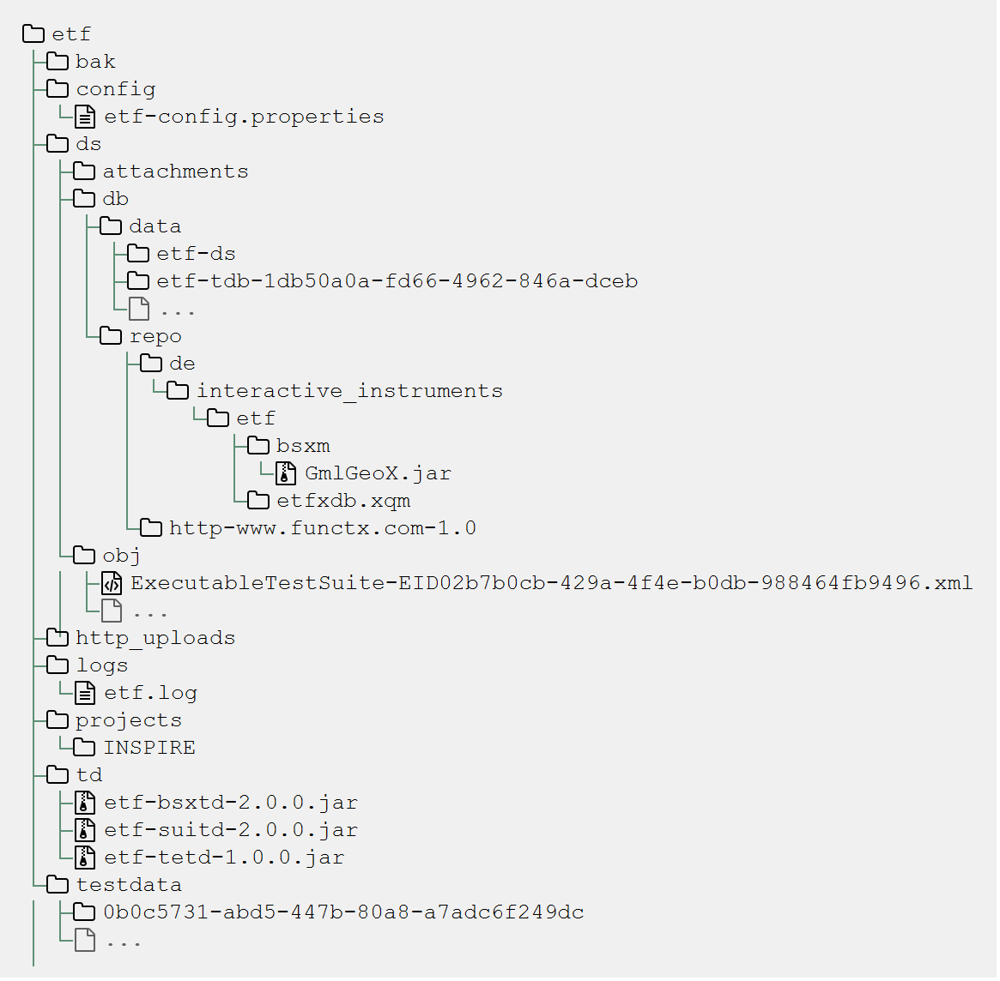

== ETF configuration

=== Data directory configuration

The deployment directory, in which the ETF web app is deployed by the web
application server, can not be used to store data because it is also deleted,
when the ETF web application is undeployed. Therefore a separate ETF data
directory is used.

The application determines the ETF data directory based on the operating system
in a specific order.

==== Windows

1. If the environment variable `ETF_WEBAPP_PROPERTIES_FILE` or the java
property `etf.webapp.properties.file` is set, the file will be used to
configure the etf directory.
2. If an etf-config.properties file exists in the 'etf' subfolder of the root
filesystems ('C:/etf', 'D:/etf', etc.), the file will be used to configure
the etf directory.
3. If a etf-config.properties file exists in the 'etf' subfolder of
the 'My Documents folder' (%DEFAULTUSERPROFILE%) on _Windows_, the file will
be used to configure the etf directory.
4. If on _Windows_ the etf-config.properties file exists in the
ProgramData folder ( %ALLUSERSPROFILE% ), the file will be used to configure
the etf directory.
5. If the etf-config.properties file is not found, a template configuration and
the default ETF data directory structure will be created in the ProgramData
folder ( %ALLUSERSPROFILE% ).

==== Linux

1. If the environment variable `ETF_WEBAPP_PROPERTIES_FILE` or the java
property `etf.webapp.properties.file` is set, the file will be used to
configure the etf directory.
2. If a `/etc/etf/etf-config.properties` file exists, the file will
be used to configure the etf data directory.
3. If an etf-config.properties file exists in the 'etf' subfolder of the root
filesystem ('/etf'), the file will be used to configure the etf directory.
4. If a etf-config.properties file exists in the home subfolder '~/.etf'
(note that the directory is hidden) on _Linux_, the file will be used to
configure the etf directory.
5. If the etf-config.properties file is not found, a template configuration and
the default ETF data directory structure will be created in the hidden home
subfolder '~/.etf'.

[[ETF-config-file]]
=== ETF configuration properties file

[source,properties]
----
#########################################
# ETF CONFIGURATION PROPERTY FILE
#########################################

# Version of the property path, used for backward compatibility.
# (do not modify unless you know what you are doing)
etf.config.properties.version = 2

#########################################
## General properties
#########################################

# Modify the base URL which points to the deployed web application.
# The URL is used to reference this ETF instance from the Test Reports.
# Example: http://yourserver/etf-webapp
etf.webapp.base.url = http://localhost:8080/etf-webapp

# Restrict cross-origin HTTP requests for browsers, see
# https://developer.mozilla.org/en-US/docs/Web/HTTP/Access_control_CORS
# for more information.
# Default: taken from etf.webapp.base.url
# etf.api.allow.origin = *

# An optional branding text which is shown in the header
# etf.branding.text =

# Max file upload size for test data in bytes.
# By default the max upload size is estimated based on presumable free memory
# during the start of the application.
# Hint: 524288000 bytes are 500 MB
# Default: auto
# etf.max.upload.size = auto

# Maximum size of the Test Object data in bytes.
# As compressed files can be uploaded and the maximum file upload size
# is different from the size of the extracted test files, this property
# ensures that the specified limit is not exceeded.
# Default: 5368709120 (5 GB)
# etf.testobject.max.size = 5368709120

# Expiration time for temporary Test Objects. After the time has elapsed,
# the test objects and test data are deleted.
# To deactivate this feature and keep all Test Objects, the property
# must be changed to the value 0.
# Default: 480 (8 hours)
# etf.testobject.temporary.lifetime.expiration = 480

# Expiration time for Test Reports. After the time has elapsed,
# the reports are deleted.
# To deactivate this feature and keep all Test Reports, the property
# must be changed to the value 0.
# Default: 11520 (8 days)
# etf.testreports.lifetime.expiration = 11520

# Allow access to private networks. Checked when
# a new webservice test object is created. "false" is recommended in public
# deployments.
# Default: false
# etf.testobject.allow.privatenet.access = false

# Recreate the internal BaseX configuration file (.basex) on startup. "true" is
# recommended.
# Default: true
# etf.bsx.recreate.config = true

# Possible values default/simplified . A simplified workflow enables the user
# to start a test run without creating a test object.
# Default: simplified
# etf.workflows = simplified

# Help to improve our application by automatically reporting internal errors
# (last user action, error message and stacktrace) to interactive instruments through
# the third party service platform opbeat (see https://opbeat.com/about for more information).
# Default: false
# etf.errors.autoreport = false

##################################################################################
## Contact, legal notice, privacy statement
##################################################################################
#
# Please note: you can add multiple lines by using the \ character at the end
# of the line.
#

# Contact
# etf.meta.contact.text = 
Operator A
 \
#                    
X Avenue
 \
#                    
Fort Lauderdale
 \
#                    
Broward County
 \
#                    
Florida, USA
 \
#                     \
#                    
Email: nielsen@a.com

# Disclaimer shown under Legal notice
# etf.meta.legalnotice.disclaimer.text = Disclaimer ...

# Copyright notice only shown under Legal notice if Disclaimer is set!
# etf.meta.legalnotice.copyrightnotice.text = Copyright notice ...

# Privacy statement
# etf.meta.privacystatement.text = Privacy statement ...

# The link to the help page can be overridden with this property.
# Default: http://docs.etf-validator.net
# etf.help.page = http://docs.etf-validator.net

#########################################
## Directory properties
#########################################

# For all directories, paths can be set that are either absolute or
# relative to the etf.dir. If the etf.dir is not specified it is
# set to ../ relative to this configuration file.

# Optional base path
# Default: ../
# etf.dir = /data/etf

# Directory for the test projects
# Default: projects
# etf.projects.dir = projects

# Directory which contains the reports styles
# Default: reportstyles
# etf.reportstyles.dir = reportstyles

# Directory which contains the test drivers
# Default: td
# etf.testdrivers.dir = td

# Directory that the application uses for text data tests
# Default: testdata
# etf.testdata.dir = testdata

# Directory for the internal data source
# Default: ds
# etf.datasource.dir = ds

# Directory that the application uses to store uploaded files
# Default: http_uploads
# etf.testdata.upload.dir = http_uploads

# Directory that the application uses to backup files
# Default: bak
# etf.backup.dir = bak

----

=== ETF data directory structure

This chapter describes the structure of the ETF data directory. The following
figure shows an example structure, identifiers or version numbers may be
different in your setup.

NOTE: When ETF is started from a docker image not all directories are mounted
on the host.

.ETF data directory

////
only works on Windows with Asciidocfx
[tree,file="../images/etf-data-dir.png"]
--
etf
|--bak
|--config
|  `--etf-config.properties
|--ds
|  |--attachments
|  |--db
|  |  |--data
|  |  |  |--etf-ds
|  |  |  |--etf-tdb-1db50a0a-fd66-4962-846a-dceb
|  |  |  `--...
|  |  `--repo
|  |     |--de
|  |     |  `--interactive_instruments
|  |     |     `--etf
|  |     |        |--bsxm
|  |     |        |  `--GmlGeoX.jar
|  |     |        `--etfxdb.xqm
|  |     `--http-www.functx.com-1.0
|  `--obj
|  |  |--ExecutableTestSuite-EID02b7b0cb-429a-4f4e-b0db-988464fb9496.xml
|  |  `--...
|--http_uploads
|--logs
|  `--etf.log
|--projects
|  `--INSPIRE
|--td
|  |--etf-bsxtd-2.0.0.jar
|  `--etf-suitd-2.0.0.jar
`--testdata
|  |--0b0c5731-abd5-447b-80a8-a7adc6f249dc
|  `--...
--
////

. The *bak* directory is used for internal backups.
anchor:etf-configuration-dir[ETF configuration file]
. The <<ETF-config-file>> is located in the *config* directory. Changes to
this file will only take effect after restarting the ETF.
. The *ds* directory is used for storing data and contains a *attachments*
subfolder for files that are downloaded or created during a Test Run.
In the *obj* folder XML representations of all framework items
(Executable Test Suites, Reports, etc.) are stored. These items are also stored
in a database that is saved in the *db/data/etf-ds* directory. Other databases
in the *db/data/* folder, are created during test runs to speed up test queries.
The *db/repo* folder contains extensions for the database.
. Files that are uploaded to the framework are temporary stored in the
*http_uploads* folder and afterwards moved to the *testdata* directory.
anchor:etf-log-file[ETF log file]
. The ETF log file location depends on whether the system environment
variables **CATALINA_HOME** or **TOMCAT_HOME** are set. If so the file is
stored in the *TOMCAT_HOME\logs* or *CATALINA_HOME\logs* directory. This is usually
the case when ETF is run from within a Tomcat application server. Otherwise the
log file can be found in the ETF data directory below the *logs* subfolder.
. Executable Test Suites must be installed in the *projects* folder.
They are automatically (re-)loaded after a short time.
. Testdrivers are loaded from the *td* directory on ETF startup.
. The *testdata* directory contains uploaded files. XML files are
indexed in databases in *db/data/etf-tdb-<UUID>* directories during a test run.

[TIP]
====
If you want to create backups of the ETF data directory, back up:

* config/etf-config.properties
* ds/obj
* logs/etf.log
====
